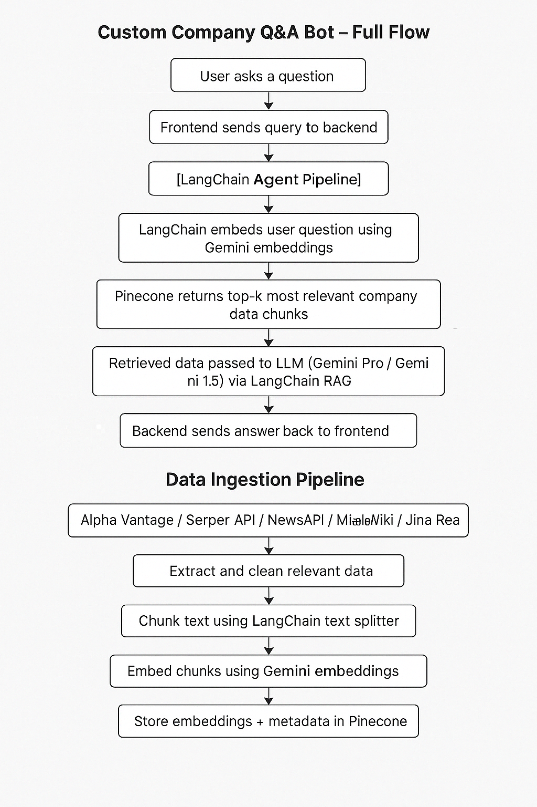

# Company Research Chatbot

AI chatbot agent that helps job seekers and investors efficiently research companies by providing real-time data on company profiles, financials, and industry comparisons. It uses persistent memory to recall user interests and previous queries across sessions, ensuring personalized and up-to-date insights—even after chat resets.

This project is a full-stack application that combines a modern web frontend with a robust Python backend to deliver a seamless company research chatbot experience.

## Tech Stack

**Frontend:**
- [Next.js](https://nextjs.org/) (React framework)
- [Tailwind CSS](https://tailwindcss.com/) (utility-first CSS framework)
- TypeScript

**Backend:**
- Python 3.11+
- [FastAPI](https://fastapi.tiangolo.com/) (high-performance API framework)
- [LangChain](https://python.langchain.com/) (LLM orchestration)
- [OpenAI API](https://platform.openai.com/) (LLM integration)
- [NumPy](https://numpy.org/), [NLTK](https://www.nltk.org/), and more for data processing

**Other:**
- Persistent chat memory (custom or vector DB)
- Shell and batch scripts for automation



## Features
- Conversational AI chatbot for company research
- Real-time company profiles, financials, and industry comparisons
- Persistent memory for personalized, context-aware conversations
- Data ingestion and embedding generation
- Modern, responsive frontend (Next.js + Tailwind CSS)
- Fast, scalable backend (FastAPI, LangChain, OpenAI)

## Project Structure
```
├── backend/
│   ├── app/
│   │   ├── agent/           # Chatbot agent logic
│   │   ├── memory/          # Persistent memory modules
│   │   ├── scripts/         # Data/scripts utilities
│   │   ├── tools/           # Custom tools for the agent
│   │   ├── config.py        # Configuration
│   │   ├── data_ingestion.py# Data ingestion pipeline
│   │   ├── embeddings.py    # Embedding generation
│   │   ├── main.py          # FastAPI entrypoint
│   │   └── utils.py         # Utilities
│   └── data/
│       └── chats/           # Chat logs/data
├── frontend/
│   ├── public/              # Static assets
│   └── src/
│       ├── app/             # Next.js app entry
│       ├── components/      # React components
│       ├── pages/           # Next.js pages
│       ├── services/        # API and data services
│       └── utils/           # Frontend utilities
├── requirements.txt         # Python dependencies
├── package.json             # Node.js dependencies
├── start-app.bat            # Start all (Windows)
├── start-backend.bat        # Start backend (Windows)
├── stop_app.bat             # Stop app (Windows)
├── run.sh                   # Start backend (Unix)
└── Work-flow.png            # Workflow diagram
```

## Getting Started

### Backend
1. **Set up Python environment**
   - Create and activate a virtual environment (see `env/` or use your own)
   - Install dependencies:
     ```sh
     pip install -r requirements.txt
     ```
2. **Run the backend**
   - On Windows:
     ```sh
     start-backend.bat
     ```
   - On Unix:
     ```sh
     ./run.sh
     ```

### Frontend
1. **Install dependencies**
   ```sh
   cd frontend
   npm install
   ```
2. **Run the frontend**
   ```sh
   npm run dev
   ```

## Scripts
- `start-app.bat`: Starts both frontend and backend (Windows)
- `start-backend.bat`: Starts backend only (Windows)
- `stop_app.bat`: Stops the application (Windows)
- `run.sh`: Starts backend (Unix)

## Contributing
Pull requests are welcome! For major changes, please open an issue first to discuss what you would like to change.


